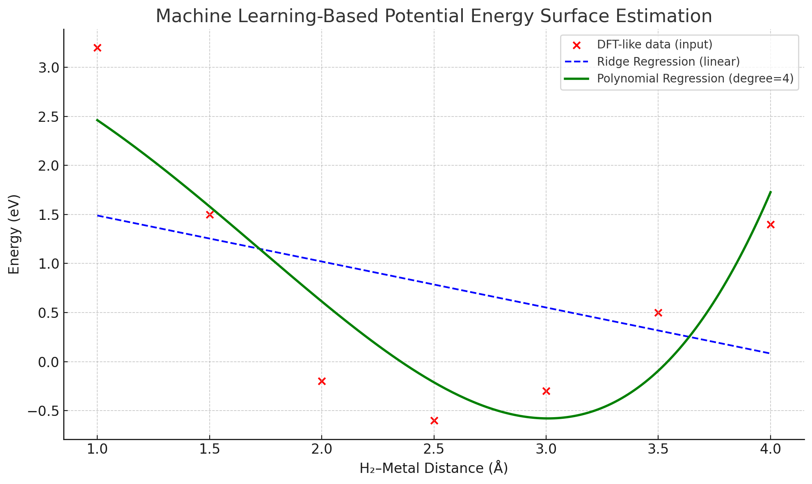

# ML-Based Potential Energy Surface Estimation (Prototype)

This project demonstrates a simple but meaningful machine learning approach to estimate the **Potential Energy Surface (PES)** for a hydrogen molecule interacting with a metal surface.

We simulate DFT-like data and use ML models to reconstruct the energy profile (PES) as a function of the H₂–metal distance. This prototype mimics the kind of modeling used in real surface chemistry studies, like those in current PhD projects at Leiden University.

---

## 🔬 Objective

To use regression models (Ridge and Polynomial) to fit a sample potential energy curve and analyze:
- Energy minimum (stable adsorption)
- Reaction barrier (activation energy)
- General shape and physical meaning of the PES

This work lays the groundwork for future DFT+ML enhanced modeling of surface reactions.

---

## 📊 Sample Graph

Below is the PES curve predicted using 4th-degree polynomial regression.

---

## 🧠 Methods

- **Sample data**: Artificial DFT-like energies for H₂ at various distances
- **Regression models**: Ridge (linear baseline), Polynomial (nonlinear behavior)
- **Visualization**: `matplotlib` plot comparing models
- **Interpretation**: Qualitative analysis of curve shape, minima, and curvature

---

## 🔍 Interpretation & Reflection

This simple model already demonstrates some key insights:

- The **Ridge Regression**, while mathematically valid, fails to represent the curved, non-linear nature of a real PES.
- The **Polynomial Regression** (degree 4) captures both the energy minimum and the correct curvature, resembling a realistic molecular interaction.
- Even with only 7 data points, the model can reconstruct a plausible PES – showing how machine learning can bridge the gap between sparse DFT data and continuous energy landscapes.
- This kind of ML approximation could be useful in computationally expensive systems, or as part of hybrid modeling strategies (like the “best-of-both-worlds” approach discussed in recent literature).

> As a researcher, this result encourages me to further expand the model to include multiple metals and use more sophisticated ML architectures – while grounding everything in physical meaning.

---

## 💡 Next Steps

This prototype could be extended with:
- Real DFT data from GPAW or VASP
- Advanced ML models (SVR, Neural Networks)
- Force derivation from PES (for MD)
- Multi-dimensional PES for complex reactions

---

## 🧑‍🔬 Author

This project is developed as part of a learning and research path toward ML-assisted quantum simulations of chemical reactions on metal surfaces.

